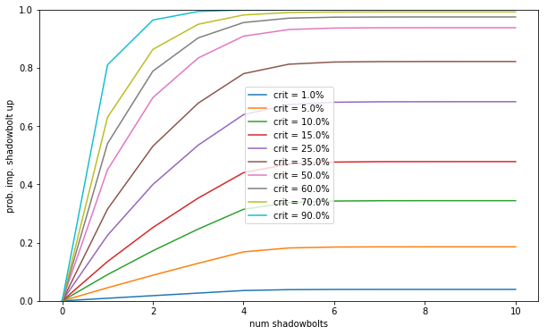

# Shadowbolt damage calculation
*\<North\> Joik, Golemagg EU - http://alfla.no*

Several factors affect final shadowbolt damage and dps. The following list represents the most important ones in my opinion (in no particular order):

- Partial or full resist (spell penetration)
- Hit or miss (spell hit)
- Spell damage scaling (including shadow spell power)
- Critical strike and multiplier (Ruin, critical strike)
- Spell cast time (Bane)
- Improved shadowbolt
- Player buffs
- Target debuffs

Most of these effects can be controlled by gear and talents. An important question is thus what the best gear and talent composition is for pure shadowbolt spamming (which is usually the case as a DPS warlock).

## Partial or full resists
Depending on target reistances, here's a table of partial to full resists i found [on wowhead (click me).](https://classic.wowhead.com/guides/warlock-dps-stat-priority-classic-wow)

| Enemy Resistance | 0    | 30   | 50    | 90    | 150   | 200 | 300 |
| ---              | ---  | ---  | ---   | ---   | ---   | --- | --- |
| Fully Resist     | 0%   | 0%   | 0%    | 1%    | 1%    | 4%  | 25% |
| 75%   Resist     | 0%   | 1%   | 2%    | 3%    | 11%   | 23% | 55% |
| 50%   Resist     | 0%   | 5%   | 9%    | 17%   | 37%   | 48% | 16% |
| 25%   Resist     | 0%   | 18%  | 28%   | 45%   | 39%   | 21% | 3%  |
| Full  Damage     | 100% | 76%  | 61%   | 35%   | 12%   | 4%  | 1%  |
| Average DPS Lost | 0%   | 7.5% | 12.5% | 22.5% | 37.5% | 50% | 75% |

## Hit or miss
The base hit chance depends on the target you are attacking. However, there is always a 1% chance to miss, regardless of your gear or target level. If your target is level 63 (like most bosses) your base chance to miss is 17%. On level 60 targets, the base miss is 4%. This means that you cap out on hit gear after 3% hit on level 60 targets and on 16% hit versus level 63 targets.

## Spell damage scaling
Spells have different scaling with spell/shadow damage gear. For shadowbolt this number is 85.71%. This means that 100 spellpower from gear increases your base shadowbolt damage by 85.71 damage.

## Critical strikes
If a spell critically strikes, it deals 150% damage. If you have the Ruin talent, this is increased to 200%. You get 1% crit chance for each 60 intellect you have, in addition to critical strike chance you get directly from gear.

## Spell cast time
Your DPS depends on how fast you are able to dish out shadowbolts. A shadowbolt has a base cast time of 3 seconds, reduced to 2.5 seconds if you have Bane. To see how this impacts your DPS, let's say your average base shadowbolt damage is $D$. If your cast time is 3.0 seconds, your dps would be:
$$
\text{DPS without Bane} = \frac{D}{3.0},
$$
and with Bane this would be:
$$
\text{DPS with Bane} = \frac{D}{2.5}.
$$
This means that the DPS increase is given by:
$$
\text{DPS ratio} = \frac{\text{DPS with Bane}}{\text{DPS without Bane}} = \frac{3.0}{2.5} = 1.2 = 120\%
$$
which means that the Bane talent gives a whopping 20% damage increase, regardless of your gear or target.

## Improved shadowbolt

Now things get interesting. Improved shadowbolt has a fairly complicated mechanic, where a critical strike gives 4 charges of *improved shadowbolt*. The higher your critical strike chance, the more likely you are to have charges up on the target you are attacking. Assuming you are playing with multiple warlocks on a single target, and that each warlock has the same critical strike chance, the only difference will be that you will reach a steady state of improved shadowbolt probability faster. Things get way more complicated if warlocks have varying degrees of critical strike (which is usually the case). But this analysis is still interesting since it gives an intuition to what level of critical strike is needed to have more or less constant uptime of improved shadowbolt.

The following analysis assumes that all warlocks attacking the same target has the same level of hit chance and critical strike chance. The Markov Chain illustrated in this section can be represented by the following matrix of transition probabilities:
\begin{equation}
\Pi = 
\begin{bmatrix}
1 - p_h p_c   & 0             & 0             & 0             & p_h p_c \\
p_h (1 - p_c) & 1 - p_h       & 0             & 0             & p_h p_c \\
0             & p_h (1 - p_c) & 1 - p_h       & 0             & p_h p_c \\
0             & 0             & p_h (1 - p_c) & 1 - p_h       & p_h p_c \\
0             & 0             & 0             & p_h (1 - p_c) & p_h p_c + (1 - p_h)
\end{bmatrix}
\end{equation}
where $p_h$ is the probability that the warlocks have to hit the given target (given by target level and hit gear) and $p_c$ is the probability that the warlocks have to critically strike the given target (given by buffs and gear).

Simulation of this forward in time shows that the hit rate only affects the rate at which you reach a steady state uptime of improved shadowbolt. This should be fairly intuitive, and with multiple warlocks this steady state is reached even faster (since multiple shadowbolts land in the same time interval). The actual steady state probability that improved shadowbolt is up for a given critical strike chance is perhaps more interesting, and is shown in a plot here.

The plot shows that for a critical strike chance above 70%, you have more or less permanent uptime of improved shadowbolt. While at 35% critical strike chance it's close to 50% uptime.

## Expected shadowbolt damage
So what does all of this amount to? What's the expected damage for a shadowbolt given all of these assumptions? We could also calculate the variance, but I will leave that as an exercise to the reader.

First, let's define a few useful quantities to be able to do the algebra necessary. 

When a shadowbolt hits a target, there's a number of binary events that can happen. This includes critical strikes, hit/miss, partial resists, etc. For all of these events, it's useful to define an *indicator* $\delta$ that represents if that event has happened or not. This simplifies algebra dealing with these types events.

\begin{equation}
\begin{aligned}
\delta_h &= \text{1 if shadowbolt hits, 0 otherwise} \\
\delta_c &= \text{1 if shadowbolt crits, 0 otherwise} \\
\delta_r &= \text{1 if target partially resists, 0 otherwise} \\
\delta_s &= \text{1 if improved shadowbolt is up, 0 otherwise}
\end{aligned}
\end{equation}
These quantities represent all of the randomness for a given shadowbolt cast in this analysis. The expected value for these indicators are given by their respective probabilities, and note that they are all assumed to be independent random variables. For example, for critical strike this is given by
\begin{equation}
\mathbf{E}\left[ \delta_c \right] = p_c
\end{equation}

In addition, there's a number of constants that we need to define that are given by either the players gear or the target we are attacking.

\begin{equation}
\begin{aligned}
\mu &= \text{shadowbolt base damage} \\
\phi &= \text{shadowbolt spell scaling} = 0.8571 \\
\lambda &= \text{spell and shadow damage from gear and buffs} \\
\gamma &= \text{critical strike multiplier, 2.0 with Ruin and 1.5 without} \\
\zeta &= \text{improved shadowbolt multiplier} = 1.2 \\
p_c &= \text{critical strike probability given by gear and buffs} \\
p_h &= \text{spell hit probability given by gear and target level} \\
p_s &= \text{steady state probability of improved shadowbolt}
\end{aligned}
\end{equation}

Now that we have all of the variables and constants that we need, we can define the shadowbolt damage $D$:
\begin{equation}
D = \delta_h \Sigma_i^4 \left[ 
    \delta^i_r \frac{i}{4}
    \left(\gamma \delta_c + \left(1 - \delta_c\right)\right)
    \left(\zeta \delta_s + \left(1 - \delta_s\right)\right)
    \left(\phi \lambda + \mu\right)
    \right] 
\end{equation}

The sum $\Sigma$ is there to account for partial resists. But since this is given by the target and its debuffs, it's not included in the calculation of the expected damage, given by the following expression:
\begin{equation}
\mathbf{E}\left[D\right] = p_h \left(\zeta p_s + \left(1 - p_s\right)\right) \left(\gamma p_c + \left(1 - p_c\right)\right) \left(\phi \lambda + \mu\right)
\end{equation}
